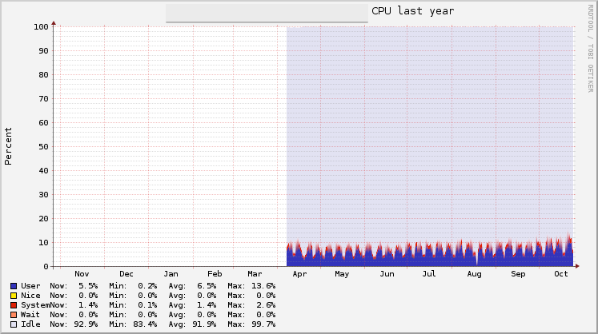

# Logjam Tools

A collection of programs and daemons to build the server side
infrastructure for logjam (see https://github.com/skaes/logjam_app).

<a href="https://scan.coverity.com/projects/3357">
  
</a>

Currently three daemons are provided:

## logjam-device

A daemon which offers a ZeroMQ PULL socket endpoint for applications
to connect to and a ZeroMQ SUB socket for forwarding. It optionally
subscribes to a RabbitMQ server to collect application messages from
there and republishes them on the PUB socket. You can run as many of
those devices as needed to scale the logging infrastructure.

## logjam-importer

A multithreaded daemon using CZMQ's actor framework which is scheduled
to replace all of the ruby importer code still in logjam. It's much
less resource intensive than the ruby code and a _lot_ faster, while
still very stable: it has been in production use since April 2014 and
hasn't crashed once.

## logjam-httpd

A daemon which takes frontend performance data via HTTP GET requests
and publishes it on on ZeroMQ PUB socket for the importer to pick up.

## Speed

On my iMac, one logjam-device can forward 20K messages per second (4K
message size). This is about 20 times faster than my original attempt
using ruby. The importer currently handles up to 30K app messages per
second on moderate hardware and scales with the number of cores.



See also: (; http://www.youtube.com/watch?v=1S1fISh-pag ;)


# Dependencies

* librabbitmq (0.5.2)
* libzmq (4.0.5)
* libczmq (3.0.0rc1)
* mongo-c-driver (git master, 1.0.2 has a memory leak)
* libbson (included in mongo-c-driver as a submodule)
* json-c (0.12 patched)

# Installation

Start by cloning the repository:
```
git clone git://github.com/skaes/logjam-tools.git
cd logjam-tools
```

Then, run `./bin/install-libs` to install all dependecies in `/usr/local`.

Or install them manually:
* Download and install rabbitmq-c from https://github.com/alanxz/rabbitmq-c/releases/tag/v0.5.2
* Download and install zmq 4.0.5 from http://zeromq.org/intro:get-the-software
* Dowmload and install czmq 3.0.0rc1 from http://czmq.zeromq.org/page:get-the-software
* Clone https://github.com/skaes/json-c.git checkout
  36be1c4c7ade78fae8ef67280cd4f98ff9f81016, build and install
* Clone https://github.com/mongodb/mongo-c-driver, checkout
  048c851919dc32c98b5f8a9a0270e69af9385db3, build and install


Finally
```
sh autogen.sh
make
sudo make install
```

The generated `./configure` script will try to use `pkg-config` to find the
required libraries. If `pkg-config` is not installed, it assumes the
headers and libraries are installed under `/usr/local` or
`/opt/local`. If they're somewhere else, you can specify
`--with-opt-dir=dir1:dir2:dir3` as argument to `sh autogen.sh` (or
`./configure`).


## License

GPL v3. See LICENSE.txt.
